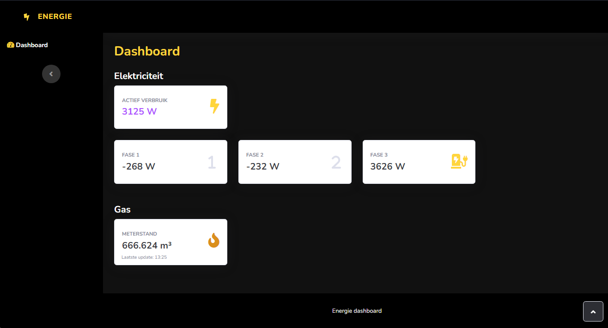

# Home Wizard Energy dashboard

Dashboard gemaakt om je energie verbruik thuis te monitoren per fase.
Voor dit project gebruikte ik een [Home Wizard P1 Meter](https://www.homewizard.com/p1-meter/).

### Functionaliteit

**Elektriciteit**

* `Actief verbruik` : Toont het actief verbruik van je huis. Als je zonnepanelen hebt kan dit ook negatief gaan. In dit geval lever je energie terug aan het net.
* `Fase 1` : Elektriciteit verbruik op fase 1.
* `Fase 2` : Elektriciteit verbruik op fase 1.
* `Fase 3` : Elektriciteit verbruik op fase 1. (In mijn geval met een Auto lader vandaar het icoontje)

**Gas**

* `Meterstand`: Geeft de meterstand van je Gasteller door. Onderaan staat telkens het tijdstip van de laatste meting.

### Setup

In `assets\js\data.js` staat er een url van waar de data wordt gehaald. Verander het IP adress naar het IP adress van jouw Home Wizard meter om de applicatie te doen werken.
